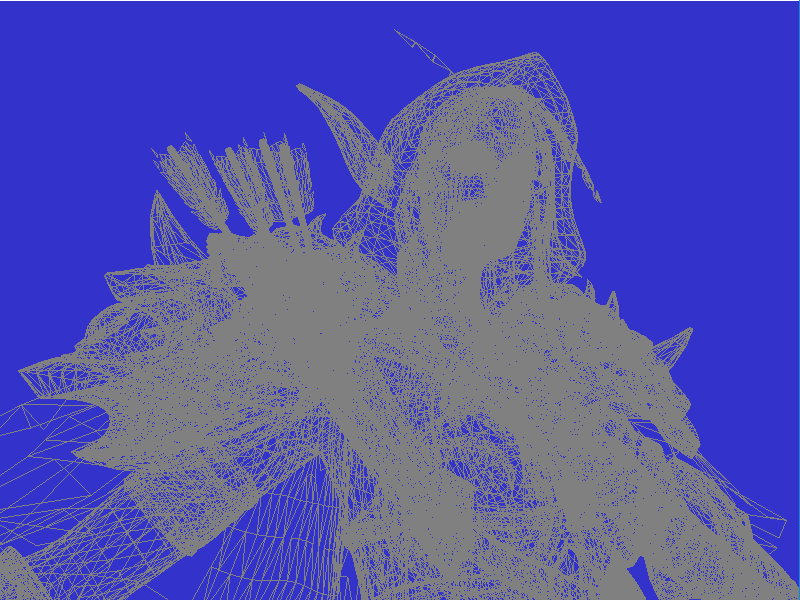

A OpenGL project to load OBJ models into a 3D Space we can use a 3D camera to navigate around and interact with the models. 

The Camera allows:
*yaw (mouse left, right)
*pitch (mouse up, down)
*left (A key)
*right (D key)
*forward (W key)
*backward (S key)
*up (E key)
*down (C key)

OpenSource Libraries/ Dependencies:
*GLM
*GLFW3
*GLEW
*stb_image

<<<<<<< HEAD
Loading a free Sylvanas model I found online in Wireframe mode.

 
=======
Screen shot of the OBJ file loading into the project in wireframe mode.

>>>>>>> dce3172d84e537e7e1c4239176cce1736e9bc729
